# EverCore Evaluation Integration Architecture

本文档描述 `methods/EverCore/evaluation/` 的评测集成架构。目标是让读者不依赖原项目上下文，也能按同样的边界、接口和运行流程搭建出一套等价的 memory-system evaluation framework。

文档分两层说明：

- **当前实现事实**：本仓库现在已经实现、CLI 实际使用的结构。
- **复刻约束**：如果重新搭建同样架构，需要保留的接口、数据流、隔离策略和扩展方式。

## 1. 总览

Evaluation framework 的核心思想是把 **benchmark 适配** 和 **method/system 适配** 分开：

```mermaid
flowchart LR
    A["Raw benchmark files"] --> B["Dataset converter"]
    B --> C["LoCoMo-style JSON or native LoCoMo-style JSON"]
    C --> D["Internal Dataset dataclasses"]
    D --> E["System adapter add()"]
    E --> F["System memory/index/backend"]
    F --> G["System adapter search()"]
    G --> H["SearchResult"]
    H --> I["System adapter answer()"]
    I --> J["AnswerResult"]
    J --> K["Evaluator"]
    K --> L["EvaluationResult + report"]
```



当前架构不是为每个 benchmark 和每个 method 写一套专用评测逻辑，而是采用两个统一面：

1. **Benchmark 统一面**：所有 benchmark 最终进入统一的 `Dataset / Conversation / Message / QAPair` 数据模型。
2. **Method 统一面**：所有 memory system 通过 adapter 暴露 `add / search / answer` 语义。

当前主流程是 answer-level evaluation：先检索，再用检索 context 生成答案，最后只评估答案是否正确。它不会在主 evaluator 里计算 retrieval recall、precision、F1。

## 2. 当前已集成对象

### 2.1 Benchmarks

当前可通过 dataset config 选择的 benchmark 有 4 个：

| Dataset CLI name | Config file | 输入形态 | 处理方式 |
| --- | --- | --- | --- |
| `locomo` | `config/datasets/locomo.yaml` | LoCoMo-style JSON | 直接加载 |
| `longmemeval` | `config/datasets/longmemeval.yaml` | LongMemEval raw JSON | 自动转换成 LoCoMo-style JSON |
| `personamem` | `config/datasets/personamem.yaml` | CSV + JSONL | 自动转换成 LoCoMo-style JSON |
| `evermembench` | `config/datasets/evermembench.yaml` | LoCoMo-style JSON | 直接加载，使用 hybrid evaluator |

当前 converter registry 只注册了：

- `longmemeval`
- `personamem`

`locomo` 和 `evermembench` 没有 converter，默认按 native LoCoMo-style JSON 读取。

### 2.2 Methods / Memory Systems

当前真正有 adapter 文件和 system config 的唯一 memory system 有 5 类。下表按接入形态展开，因此 EverCore 会出现两行：

| System | Config names | Adapter |
| --- | --- | --- |
| EverCore / EverMemos local in-process | `evermemos` | `EverCoreAdapter` |
| EverCore HTTP API | `evermemos_local_api`, `evermemos_cloud_api` | `EverCoreAPIAdapter` |
| Mem0 | `mem0` | `Mem0Adapter` |
| MemOS / Memos | `memos` | `MemosAdapter` |
| MemU | `memu` | `MemuAdapter` |
| Zep | `zep` | `ZepAdapter` |

按 CLI system config 文件数量算是 7 个配置：

- `evermemos`
- `evermemos_local_api`
- `evermemos_cloud_api`
- `mem0`
- `memos`
- `memu`
- `zep`

`adapters/registry.py` 里还写了 `memobase` 和 `supermemory`，但当前仓库没有对应 adapter 文件，也没有 system yaml。复刻时不要把它们算作已完成集成，除非补齐实现。

## 3. 目录结构规范

完整 evaluation 子系统建议保持如下结构：

```text
evaluation/
├── cli.py
├── README.md
├── config/
│   ├── datasets/
│   │   ├── locomo.yaml
│   │   ├── longmemeval.yaml
│   │   ├── personamem.yaml
│   │   └── evermembench.yaml
│   ├── systems/
│   │   ├── evermemos.yaml
│   │   ├── evermemos_local_api.yaml
│   │   ├── evermemos_cloud_api.yaml
│   │   ├── mem0.yaml
│   │   ├── memos.yaml
│   │   ├── memu.yaml
│   │   └── zep.yaml
│   └── prompts.yaml
├── data/
│   ├── locomo/
│   ├── longmemeval/
│   ├── personamem/
│   └── evermembench/
├── results/
│   └── {dataset}-{system}[-{run_name}]/
└── src/
    ├── adapters/
    │   ├── base.py
    │   ├── online_base.py
    │   ├── registry.py
    │   └── *_adapter.py
    ├── converters/
    │   ├── base.py
    │   ├── registry.py
    │   └── *_converter.py
    ├── core/
    │   ├── data_models.py
    │   ├── loaders.py
    │   ├── pipeline.py
    │   └── stages/
    │       ├── add_stage.py
    │       ├── search_stage.py
    │       ├── answer_stage.py
    │       └── evaluate_stage.py
    ├── evaluators/
    │   ├── base.py
    │   ├── exact_match.py
    │   ├── llm_judge.py
    │   ├── hybrid.py
    │   └── registry.py
    └── utils/
        ├── checkpoint.py
        ├── cleaner.py
        ├── config.py
        ├── logger.py
        ├── prompts.py
        └── saver.py
```

复刻这个架构时，必须保留四个核心扩展点：

- `converters/`：接入新 benchmark。
- `adapters/`：接入新 memory system。
- `evaluators/`：接入新评估指标。
- `config/`：用 YAML 选择 dataset、system、evaluator、并发、模型和后端参数。

## 4. 统一数据模型

统一数据模型定义在 `src/core/data_models.py`。这是 benchmark 和 method 之间的核心契约。

### 4.1 Message

```python
@dataclass
class Message:
    sender_id: str
    sender_name: str
    content: str
    timestamp: Optional[datetime] = None
    metadata: Dict[str, Any] = field(default_factory=dict)
```

含义：一条对话消息，也就是一个 turn。

字段说明：

- `sender_id`
  - 系统内部使用的说话人 ID。
  - 通常会带上 `conversation_id`，避免不同 conversation 的同名 speaker 串数据。
  - LoCoMo loader 当前生成形式类似：`{speaker_lower}_{conv_id}`。
- `sender_name`
  - 原始说话人名字。
  - 可以是 `Caroline`、`Melanie`、`User`、`Assistant`、`user_xxx` 等。
- `content`
  - 消息正文。
  - 如果原始消息带图片信息，loader 会把图片 caption 拼进 content。
- `timestamp`
  - 可选时间戳。
  - LoCoMo 有 session 时间，loader 会给 session 内每条 message 分配时间。
  - PersonaMem 这类无时间数据会生成 fake timestamp。
- `metadata`
  - 扩展字段。
  - 当前常见字段包括：
    - `session`
    - `dia_id`
    - `img_url`
    - `blip_caption`
    - `query`
    - `timestamp_source`

### 4.2 Conversation

```python
@dataclass
class Conversation:
    conversation_id: str
    messages: List[Message]
    metadata: Dict[str, Any] = field(default_factory=dict)
```

含义：一个 benchmark sample 对应的一整段对话。

字段说明：

- `conversation_id`
  - 全局唯一的对话样本 ID。
  - 当前 loader 使用 `{dataset_name}_{idx}`，例如 `locomo_0`、`longmemeval_12`。
  - 这是隔离 memory namespace 的关键字段。
- `messages`
  - 展平后的消息列表。
  - 注意：内部模型没有 `Session` class。LoCoMo 的 `session_0/session_1/...` 会被展平成一个消息列表。
- `metadata`
  - 对话级元信息。
  - 当前主要保存：
    - `speaker_a`
    - `speaker_b`

### 4.3 QAPair

```python
@dataclass
class QAPair:
    question_id: str
    question: str
    answer: str
    category: Optional[str] = None
    evidence: List[str] = field(default_factory=list)
    metadata: Dict[str, Any] = field(default_factory=dict)
```

含义：一个待回答问题。

字段说明：

- `question_id`
  - 问题 ID。
  - 如果原始数据没有，loader 会生成 `{conv_id}_qa{qa_idx}`。
- `question`
  - 问题文本。
- `answer`
  - golden answer。
  - 对选择题，当前保存的是正确选项，如 `(a)`、`(b)`。
- `category`
  - 问题类别，统一成字符串。
  - 示例：
    - LoCoMo: `"1"`, `"2"`, `"3"`, `"5"`
    - LongMemEval: `"single-session-user"`, `"temporal-reasoning"`
    - PersonaMem: `"recall_user_shared_facts"`
- `evidence`
  - 原始 benchmark 给出的证据位置。
  - 当前主 evaluator 不使用它计算 retrieval recall。
  - 保留它是为了后续扩展 evidence-level evaluation。
- `metadata`
  - 必须包含 `conversation_id`，因为 search stage 用它把 QA 分组到对应 conversation。
  - 选择题还会包含 `all_options`。

### 4.4 Dataset

```python
@dataclass
class Dataset:
    dataset_name: str
    conversations: List[Conversation]
    qa_pairs: List[QAPair]
    metadata: Dict[str, Any] = field(default_factory=dict)
```

含义：一次评测加载得到的完整数据集。

字段说明：

- `dataset_name`
  - 数据集名字。
- `conversations`
  - 所有 conversation。
- `qa_pairs`
  - 所有 QA，跨 conversation 平铺。
- `metadata`
  - 数据集级元信息，例如 `total_conversations`。

### 4.5 SearchResult

```python
@dataclass
class SearchResult:
    query: str
    conversation_id: str
    results: List[Dict[str, Any]]
    retrieval_metadata: Dict[str, Any] = field(default_factory=dict)
```

含义：检索阶段输出。

字段说明：

- `query`
  - 检索 query，通常就是问题文本。
- `conversation_id`
  - 当前检索属于哪个 conversation。
- `results`
  - 检索出的 memory 列表。
  - 标准推荐格式：

```python
[
    {
        "content": "memory text shown to answer LLM",
        "score": 0.87,
        "metadata": {
            "raw": "...",
            "timestamp": "...",
            "source": "..."
        }
    }
]
```

- `retrieval_metadata`
  - 检索额外信息。
  - 常见字段：
    - `system`
    - `top_k`
    - `user_ids`
    - `group_id`
    - `dual_perspective`
    - `formatted_context`
  - 如果 adapter 设置了 `formatted_context`，answer stage 会优先使用它，而不是简单枚举 `results[*].content`。

### 4.6 AnswerResult

```python
@dataclass
class AnswerResult:
    question_id: str
    question: str
    answer: str
    golden_answer: str
    category: Optional[int] = None
    conversation_id: str = ""
    formatted_context: str = ""
    search_results: List[Dict[str, Any]] = field(default_factory=list)
    metadata: Dict[str, Any] = field(default_factory=dict)
```

含义：回答阶段输出。

字段说明：

- `question_id`
  - 对应 QA ID。
- `question`
  - 原问题。
- `answer`
  - 系统生成答案。
- `golden_answer`
  - 标准答案。
- `category`
  - 问题类别。
  - 当前 dataclass 标注为 `Optional[int]`，但实际 loader 会把 category 统一为字符串。复刻时建议改为 `Optional[str]`，但若要完全贴近当前实现，可以保留现状。
- `conversation_id`
  - 当前 QA 所属 conversation。
- `formatted_context`
  - 实际喂给 answer LLM 的上下文。
  - 这是复现实验非常重要的中间产物。
- `search_results`
  - 字段保留，但当前保存 `answer_results.json` 时不会保存完整 search results，主要为了减小体积。
- `metadata`
  - QA 元信息，例如 `all_options`。

### 4.7 EvaluationResult

```python
@dataclass
class EvaluationResult:
    total_questions: int
    correct: int
    accuracy: float
    detailed_results: List[Dict[str, Any]] = field(default_factory=list)
    metadata: Dict[str, Any] = field(default_factory=dict)
```

含义：最终评估结果。

字段说明：

- `total_questions`
  - 总问题数。
- `correct`
  - 判对数量。
- `accuracy`
  - 准确率。
- `detailed_results`
  - 每题评估细节。
  - LLM Judge 可能按 conversation 分组保存。
- `metadata`
  - evaluator 级统计信息，例如 run accuracies、category accuracies、标准差等。

## 5. Benchmark 数据接入

### 5.1 当前统一输入思想

概念上，所有 benchmark 最终都要表达为：

```text
Dataset
├── conversations
│   └── Conversation
│       └── Message[]
└── qa_pairs
    └── QAPair[]
```

当前代码实现上，non-native benchmark 会先转换成 LoCoMo-style JSON，再由 `load_locomo_dataset()` 转成 dataclass。

LoCoMo-style JSON 形态如下：

```json
{
  "sample_id": "...",
  "conversation": {
    "speaker_a": "...",
    "speaker_b": "...",
    "session_0_date_time": "6:07 pm on 13 January, 2023",
    "session_0": [
      {
        "speaker": "...",
        "text": "...",
        "dia_id": "D0:0"
      }
    ],
    "session_1_date_time": "...",
    "session_1": []
  },
  "qa": [
    {
      "question": "...",
      "answer": "...",
      "category": "...",
      "evidence": []
    }
  ]
}
```

重要细节：

- LoCoMo-style 里有 session。
- 内部 dataclass 里没有 session class。
- loader 会把 session 展平成 `Conversation.messages`。
- session 信息保存在每条 message 的 `metadata["session"]`。
- QA 会平铺成全局 `Dataset.qa_pairs`，并通过 `qa.metadata["conversation_id"]` 关联 conversation。

### 5.2 Loader 工作流

`load_dataset(dataset_name, data_path, max_content_length)` 的当前逻辑：

1. 根据 `dataset_name` 查 converter registry。
2. 如果找到 converter：
   - 如果 converted file 不存在，则调用 converter 生成 LoCoMo-style JSON。
   - 再加载 converted file。
3. 如果没有 converter：
   - 将输入视为 native LoCoMo-style JSON。
4. 调用 `load_locomo_dataset()` 生成 `Dataset` dataclass。

当前实现的一个关键事实：

- Dataset YAML 里的 `data.format` 当前不是 converter 选择依据。
- converter 选择依据是 CLI 的 `--dataset` 名字，也就是 `load_dataset(args.dataset, ...)` 传入的 `dataset_name`。

复刻时可以沿用这个行为，也可以改进为读取 `data.format`，但如果目标是一模一样复刻，应以 `dataset_name` 驱动 converter registry。

### 5.3 Converter 接口

`BaseConverter` 抽象接口：

```python
class BaseConverter(ABC):
    @abstractmethod
    def convert(self, input_paths: Dict[str, str], output_path: str) -> None:
        pass

    @abstractmethod
    def get_input_files(self) -> Dict[str, str]:
        pass

    def get_output_filename(self) -> str:
        return "converted_locomo_style.json"

    def needs_conversion(self, data_dir: Path) -> bool:
        return not (data_dir / self.get_output_filename()).exists()

    def get_converted_path(self, data_dir: Path) -> Path:
        return data_dir / self.get_output_filename()
```

Converter 的职责：

- 声明需要哪些原始文件。
- 读取原始 benchmark。
- 生成 LoCoMo-style JSON。
- 保存到 `evaluation/data/{dataset}/..._locomo_style.json`。

Converter 不直接返回 `Dataset` dataclass，这是当前架构的一个设计选择：converted JSON 会落盘，便于复现和调试。

### 5.4 Converter registry

Converter 使用 lazy import registry：

```python
_CONVERTER_MODULES = {
    "longmemeval": "evaluation.src.converters.longmemeval_converter",
    "personamem": "evaluation.src.converters.personamem_converter",
}
```

每个 converter 文件里用 decorator 注册：

```python
@register_converter("new_dataset")
class NewDatasetConverter(BaseConverter):
    ...
```

新增 benchmark 时需要同时做三件事：

1. 新增 `src/converters/new_dataset_converter.py`。
2. 在 `_CONVERTER_MODULES` 加入 `"new_dataset": "evaluation.src.converters.new_dataset_converter"`。
3. 新增 `config/datasets/new_dataset.yaml`。

如果新 benchmark 原生就是 LoCoMo-style JSON，可以不写 converter，只写 dataset yaml。

## 6. Dataset YAML 规范

Dataset config 控制数据路径、语言和 evaluator。

推荐结构：

```yaml
name: "longmemeval"
version: "1.0"
description: "Long-term Memory Evaluation benchmark"

memory_language: "en"

data:
  path: "longmemeval"
  format: "longmemeval"
  max_content_length: 8000

evaluation:
  type: "llm_judge"
  llm:
    provider: "openai"
    model: "gpt-4o-mini"
    api_key: "${LLM_API_KEY}"
    base_url: "${LLM_BASE_URL:https://openrouter.ai/api/v1}"
  num_runs: 3
  filter_category: []
```

字段说明：

- `name`
  - dataset 名字。
  - 应与 CLI `--dataset` 和 converter registry key 保持一致。
- `memory_language`
  - 会写入 `os.environ["MEMORY_LANGUAGE"]`。
- `data.path`
  - 相对 `evaluation/data/` 的路径。
  - 如果不存在，会尝试相对 EverCore project root 查找。
- `data.format`
  - 当前主要是说明性字段。
  - 当前 loader 不用它选 converter。
- `data.max_content_length`
  - 可选。用于 loader 截断过长消息。
- `evaluation.type`
  - `llm_judge`
  - `exact_match`
  - `hybrid`
- `evaluation.llm`
  - evaluator 使用的 judge 模型配置。
- `evaluation.num_runs`
  - LLM judge 重复判定次数。
- `evaluation.filter_category`
  - 运行前过滤某些 category。

## 7. Method / System Adapter 接口

### 7.1 BaseAdapter

所有 method 侧集成的核心接口在 `src/adapters/base.py`：

```python
class BaseAdapter(ABC):
    @abstractmethod
    async def add(
        self,
        conversations: List[Conversation],
        **kwargs
    ) -> Any:
        pass

    @abstractmethod
    async def search(
        self,
        query: str,
        conversation_id: str,
        index: Any,
        **kwargs
    ) -> SearchResult:
        pass

    async def prepare(self, conversations: List[Conversation], **kwargs) -> None:
        pass

    def get_system_info(self) -> Dict[str, Any]:
        return {"name": self.__class__.__name__, "config": self.config}

    def build_lazy_index(self, conversations: List[Conversation], output_dir: Any) -> Any:
        return None
```

严格抽象方法只有：

- `add`
- `search`

但当前 answer stage 会调用：

```python
await adapter.answer(query=query, context=context, conversation_id=...)
```

因此所有可运行 adapter 必须实现事实接口：

```python
async def answer(self, query: str, context: str, **kwargs) -> str:
    ...
```

复刻时建议把 `answer()` 也加入 `BaseAdapter` 抽象类，避免运行时才报错。但若要保持当前代码完全一致，它是事实接口，不是抽象接口。

### 7.2 add()

`add()` 是 ingest / build-index stage。

签名：

```python
async def add(
    self,
    conversations: List[Conversation],
    **kwargs
) -> Any:
    ...
```

输入：

- `conversations`
  - 统一 dataclass conversation 列表。
  - 每个 conversation 已经包含展平 messages。
- `kwargs`
  - 当前 add stage 会传：
    - `output_dir`
    - `checkpoint_manager`

职责：

1. 遍历 conversations。
2. 将 `Conversation / Message` 转成目标 memory system 的输入格式。
3. 写入 memory backend 或构建本地索引。
4. 确保 conversation 之间隔离。
5. 返回 search 阶段需要的 index metadata 或任务结果。

返回值：

- 本地系统通常返回 index metadata，例如：

```python
{
    "type": "lazy_load",
    "memcells_dir": "...",
    "bm25_index_dir": "...",
    "emb_index_dir": "...",
    "conversation_ids": ["locomo_0", "locomo_1"],
    "use_hybrid_search": True,
    "total_conversations": 2
}
```

- 在线 API 系统通常返回：

```python
{
    "type": "online_api",
    "system": "mem0",
    "conversation_ids": [...]
}
```

或者返回 `None`，只要 `search()` 不依赖它即可。

### 7.3 search()

`search()` 是 retrieval stage。

签名：

```python
async def search(
    self,
    query: str,
    conversation_id: str,
    index: Any,
    **kwargs
) -> SearchResult:
    ...
```

输入：

- `query`
  - 问题文本。
- `conversation_id`
  - 当前问题所属 conversation。
  - 必须用于隔离检索空间。
- `index`
  - `add()` 返回值。
- `kwargs`
  - 当前 search stage 会传 `conversation=conversation`。
  - adapter 可用它读取 speaker 信息。

职责：

1. 根据 `conversation_id` 定位 memory namespace。
2. 执行检索。
3. 转成标准 `SearchResult`。
4. 可选：生成 `retrieval_metadata["formatted_context"]`。

返回示例：

```python
return SearchResult(
    query=query,
    conversation_id=conversation_id,
    results=[
        {
            "content": "2023-01-01 10:00:00: Caroline likes pizza.",
            "score": 0.92,
            "metadata": {
                "source": "episodic_memory",
                "raw": raw_memory
            }
        }
    ],
    retrieval_metadata={
        "system": "propmem",
        "top_k": 10,
        "formatted_context": "Memories:\n..."
    }
)
```

### 7.4 answer()

`answer()` 是 answer generation stage 的事实接口。

签名：

```python
async def answer(self, query: str, context: str, **kwargs) -> str:
    ...
```

输入：

- `query`
  - 原问题。
  - 对选择题，answer stage 会自动把 options 拼进 query，并要求只输出 `(a)/(b)/(c)`。
- `context`
  - 来自 `SearchResult` 的检索上下文。
  - 若 adapter 提供 `formatted_context`，优先使用。
  - 否则 answer stage 会简单枚举 `results[*].content`。
- `kwargs`
  - 当前会传 `conversation_id`。

职责：

1. 使用统一 answer LLM 或系统官方推荐 prompt。
2. 基于 context 回答 query。
3. 返回纯文本答案。

设计原则：

- 对开放问答，回答应尽量短且直接。
- 对选择题，必须返回 `(a)`、`(b)` 这类选项。
- 不要在 answer 阶段访问 golden answer。

## 8. OnlineAPIAdapter 模板

在线 API 系统建议继承 `OnlineAPIAdapter`，它提供：

- LLM provider 初始化。
- 默认 `answer()`。
- speaker/user role 转换。
- single perspective / dual perspective 调度。
- conversation-level concurrency。
- result 包装 hook。

### 8.1 OnlineAPIAdapter 要实现的 hook

最少实现：

```python
async def _add_user_messages(
    self,
    conv: Conversation,
    messages: List[Dict[str, Any]],
    speaker: str,
    **kwargs
) -> Any:
    ...

async def _search_single_user(
    self,
    query: str,
    conversation_id: str,
    user_id: str,
    top_k: int,
    **kwargs
) -> List[Dict[str, Any]]:
    ...

def _build_single_search_result(...) -> SearchResult:
    ...

def _build_dual_search_result(...) -> SearchResult:
    ...
```

可选覆盖：

```python
def _get_format_type(self) -> str:
    return "basic"

def _need_dual_perspective(self, speaker_a: str, speaker_b: str) -> bool:
    ...

def _conversation_to_messages(...):
    ...

def _get_answer_prompt(self) -> str:
    ...

async def _post_add_process(self, add_results: List[Any], **kwargs) -> None:
    ...
```

### 8.2 Single vs Dual Perspective

很多 memory API 是以 `user_id` 为中心存储的。对于 LoCoMo 这种双人对话，如果 speaker 是真实姓名，框架会默认做 dual perspective：

- 从 speaker A 视角，把 A 当 user，把 B 当 assistant。
- 从 speaker B 视角，把 B 当 user，把 A 当 assistant。
- add 时写两份视角。
- search 时分别检索两个 user_id，再合并成 context。

如果 speaker 本来就是标准 `user/assistant`，则走 single perspective。

判断逻辑：

- `speaker_a` 或 `speaker_b` 是 `user` / `assistant` / 以它们开头：single perspective。
- 两边都是自定义姓名：dual perspective。

部分系统可以覆盖该逻辑。例如 EverCore HTTP API 是 group chat memory，不需要按 speaker 复制写入，所以它覆盖 `_need_dual_perspective()` 返回 `False`。

### 8.3 user_id 生成

默认 user_id 生成规则：

```python
user_id = f"{conversation_id}_{sender_name_normalized}"
```

示例：

- `locomo_0_Caroline`
- `personamem_4_Kanoa_Manu`
- `longmemeval_12_speaker_a`

设计目的：

- conversation 之间隔离。
- speaker 之间隔离。
- 在线后端可读。

## 9. Local Adapter 模板

本地系统可以直接继承 `BaseAdapter`。当前 EverCore local adapter 就是这种方式。

典型结构：

```python
@register_adapter("new_method")
class NewMethodAdapter(BaseAdapter):
    def __init__(self, config: dict, output_dir: Path = None):
        super().__init__(config)
        self.output_dir = Path(output_dir) if output_dir else Path(".")
        self.llm_provider = ...

    async def add(
        self,
        conversations: List[Conversation],
        output_dir: Path = None,
        checkpoint_manager=None,
        **kwargs,
    ) -> Dict[str, Any]:
        # 1. create output directories
        # 2. convert Conversation.messages into method input
        # 3. build memory/index per conversation
        # 4. return lazy index metadata
        return {
            "type": "lazy_load",
            "index_dir": str(index_dir),
            "conversation_ids": [c.conversation_id for c in conversations],
        }

    async def search(
        self,
        query: str,
        conversation_id: str,
        index: Any,
        **kwargs,
    ) -> SearchResult:
        # 1. locate conversation-specific index by conversation_id
        # 2. retrieve memories
        # 3. return SearchResult
        return SearchResult(...)

    async def answer(self, query: str, context: str, **kwargs) -> str:
        # use answer LLM and prompt
        return answer

    def build_lazy_index(self, conversations: List[Conversation], output_dir: Any) -> Any:
        # called when add stage is skipped but search needs metadata
        return {
            "type": "lazy_load",
            "index_dir": str(Path(output_dir) / "index"),
            "conversation_ids": [c.conversation_id for c in conversations],
        }
```

Local adapter 必须特别注意：

- index 文件必须按 conversation 隔离。
- search 只能加载当前 `conversation_id` 对应的 index。
- 如果支持跳过 add 直接跑 search，需要实现 `build_lazy_index()`。

## 10. Adapter Registry 和 System YAML

Adapter 使用 lazy import registry。

新增 method 时：

1. 新增 adapter 文件：

```text
evaluation/src/adapters/propmem_adapter.py
```

2. 在 registry 中注册 module：

```python
_ADAPTER_MODULES = {
    "propmem": "evaluation.src.adapters.propmem_adapter",
}
```

3. 在 adapter 文件里注册 class：

```python
@register_adapter("propmem")
class PropMemAdapter(BaseAdapter):
    ...
```

4. 新增 system config：

```yaml
name: "propmem"
version: "1.0"
description: "PropMem"

adapter: "propmem"

llm:
  provider: "openai"
  model: "openai/gpt-4.1-mini"
  api_key: "${LLM_API_KEY}"
  base_url: "${LLM_BASE_URL:https://openrouter.ai/api/v1}"
  temperature: 0
  max_tokens: 32768

search:
  top_k: 10

answer:
  max_retries: 3
```

CLI 会根据 `--system propmem` 加载：

```text
evaluation/config/systems/propmem.yaml
```

然后读取 `adapter: "propmem"`，通过 registry 创建 adapter 实例。

## 11. Pipeline 运行流程

Pipeline 在 `src/core/pipeline.py`，四个阶段：

1. Add
2. Search
3. Answer
4. Evaluate

### 11.1 CLI 初始化

CLI 执行：

```bash
uv run python -m evaluation.cli --dataset locomo --system evermemos
```

初始化顺序：

1. 设置 Python import path：
   - EverCore project root
   - EverCore `src/`
2. 读取 `.env`。
3. 加载 dataset yaml。
4. 根据 dataset yaml 设置 `MEMORY_LANGUAGE`。
5. 加载 system yaml。
6. 应用 system yaml 里的 `dataset_overrides`。
7. 加载 dataset。
8. 创建 output dir：
   - 默认：`evaluation/results/{dataset}-{system}/`
   - 有 run name：`evaluation/results/{dataset}-{system}-{run_name}/`
9. 创建 adapter。
10. 创建 evaluator。
11. 创建 pipeline。
12. 执行 pipeline。

### 11.2 Dataset range 和 smoke test

Pipeline 支持：

```bash
--from-conv 10 --to-conv 20
```

语义是 Python slice `[from_conv:to_conv)`。

它会：

- 保留原始 `conversation_id` 不变。
- 只选择范围内 conversations。
- 只保留这些 conversation 对应的 QA。

Pipeline 也支持：

```bash
--smoke --smoke-messages 20 --smoke-questions 5
```

它会：

- 每个 conversation 截断前 N 条 messages。
- 每个 conversation 截断前 N 个 questions。

### 11.3 Add stage

入口：

```python
run_add_stage(adapter, dataset, output_dir, checkpoint_manager, ...)
```

内部调用：

```python
index = await adapter.add(
    conversations=dataset.conversations,
    output_dir=output_dir,
    checkpoint_manager=checkpoint_manager,
)
```

Add 完成后：

- 标记 `completed_stages.add("add")`。
- 保存 cross-stage checkpoint。
- 返回 `{"index": index}`。

在线系统可配置：

```yaml
post_add_wait_seconds: 180
```

如果 add 刚完成且后续要 search，pipeline 会等待这段时间，让在线后端完成异步索引。

### 11.4 Search stage

入口：

```python
run_search_stage(adapter, qa_pairs, index, conversations, checkpoint_manager, logger)
```

行为：

1. 按 `qa.metadata["conversation_id"]` 将 QA 分组。
2. 建立 `conversation_id -> Conversation` 映射。
3. 每个 conversation 内并发检索所有问题。
4. 每处理完一个 conversation 保存 search checkpoint。
5. 返回 `List[SearchResult]`。

核心调用：

```python
result = await adapter.search(
    qa.question,
    conv_id,
    index,
    conversation=conversation,
)
```

并发控制：

```yaml
search:
  num_workers: 20
```

fallback：

- 如果未配置 `search.num_workers`，使用 `adapter.num_workers`。
- 再 fallback 到 `20`。

SearchResult 顺序很重要，因为 answer stage 会 `zip(qa_pairs, search_results)`。复刻时必须确保返回顺序和 QA 顺序一致，或者改为按 `question_id` join。

当前实现按 conversation id 的数字后缀排序，并按每个 conversation 的 QA 顺序追加结果。

### 11.5 Answer stage

入口：

```python
run_answer_stage(adapter, qa_pairs, search_results, checkpoint_manager, logger)
```

行为：

1. 对每个 `(qa, search_result)` 构造 context。
2. 如果 `qa.metadata["all_options"]` 存在，把 options 拼入 query，并要求模型只输出选项。
3. 调用 `adapter.answer()`。
4. 生成 `AnswerResult`。
5. 每 400 题保存一次 answer checkpoint。

Context 构造规则：

1. 优先使用：

```python
search_result.retrieval_metadata["formatted_context"]
```

2. 如果没有，则简单枚举：

```text
1. memory content

2. memory content
```

3. 如果 retrieval metadata 有 preferences，也会追加 preference string。

Answer 并发：

- 当前固定 `MAX_CONCURRENT = 50`。
- 每题最多 3 次 retry。
- 单次 timeout 当前代码设置为 120 秒。

### 11.6 Evaluate stage

入口：

```python
run_evaluate_stage(evaluator, answer_results, checkpoint_manager, logger)
```

行为：

```python
eval_result = await evaluator.evaluate(answer_results)
```

然后保存：

```text
eval_results.json
report.txt
```

## 12. Evaluator 设计

Evaluator 接口：

```python
class BaseEvaluator(ABC):
    @abstractmethod
    async def evaluate(self, answer_results: List[AnswerResult]) -> EvaluationResult:
        pass
```

当前已有 3 个 evaluator：

### 12.1 LLMJudge

适用：

- 开放问答。
- LoCoMo。
- LongMemEval。

逻辑：

1. 对每个 answer 调用 judge LLM。
2. 重复 `num_runs` 次。
3. 每次输出布尔判断。
4. 分别计算每次 run 的 accuracy。
5. 输出 mean accuracy 和 std。
6. 计算 category-level mean/std。

它不计算文本 F1，也不计算 BLEU/ROUGE。

### 12.2 ExactMatch

适用：

- 选择题。
- PersonaMem。

逻辑：

1. 预处理 golden 和 generated。
2. 可选抽取 `(a)`、`a)`、`a.`、单独字母等 choice。
3. 字符串相等即正确。
4. 输出 accuracy。

### 12.3 HybridEvaluator

适用：

- 同一 benchmark 同时包含开放问答和选择题。
- EverMemBench。

逻辑：

- 如果 `answer_result.metadata` 有 `all_options`：走 ExactMatch。
- 否则：走 LLMJudge。
- 最后合并结果并计算整体 accuracy 和 category stats。

### 12.4 关于 Recall / F1

当前主流程不评估 retrieval recall / precision / F1。

原因：

- 不同 memory system 的存储粒度不同：
  - 有的保存原始 episode。
  - 有的保存抽象事实。
  - 有的保存 preference/profile。
  - 有的保存图节点/边。
- 很多在线系统不会暴露可和 benchmark evidence 对齐的原始 memory id。
- evidence 在不同 benchmark 里的定义也不统一。

因此当前评价目标是：

```text
retrieved context 是否足够让 answer LLM 答对问题
```

最终指标主要是：

- accuracy
- category-level accuracy
- LLM judge mean/std

如果后续要增加 retrieval metrics，应新增 evaluator 或 search evaluator，并明确：

- evidence id 格式。
- memory item id 格式。
- hit 判定规则。
- top-k cutoff。
- 是否支持语义等价 evidence。

## 13. 隔离策略

真实评测中，conversation 之间必须隔离。否则一个 conversation 的记忆会污染另一个 conversation，结果不可用。

当前架构主要通过 namespace 隔离，而不是每个 conversation 后都物理清空。

### 13.1 本地 EverCore 隔离

本地 EverCore adapter：

- 每个 conversation 生成独立 memcell 文件。
- 每个 conversation 生成独立 BM25 index。
- 每个 conversation 生成独立 embedding index。
- search 时根据 `conversation_id` 只加载对应 index。

因此本地 EverCore 不需要在每个 conversation 后清空全局 memory。

### 13.2 在线系统隔离

在线系统通常采用：

- `user_id` 隔离。
- `group_id` 隔离。
- graph id 隔离。

默认 `OnlineAPIAdapter` 会把 `conversation_id` 编进 `user_id`：

```text
{conversation_id}_{speaker_name}
```

EverCore HTTP API 使用：

```text
group_id = conversation_id
```

Zep 使用 conversation graph 思路，通常以 `conversation_id` 对应 graph id。

### 13.3 重复运行的污染风险

如果重复跑同一个在线后端、同一个 dataset、同一个 conversation id，旧 memory 可能残留，导致重复写入或污染。

解决方式：

1. 每次 run 生成唯一 namespace：
   - 例如把 run name 加入 user_id/group_id。
2. Add 前清理对应 namespace。
3. 使用全新后端 project / collection。

当前 EverCore API adapter 支持：

```bash
--clean-groups
```

它会对本次涉及的 conversation id 调用 group cleanup。

注意：

- `BaseAdapter.prepare()` 设计上可以用于清理，但当前主 pipeline 没有统一调用 `adapter.prepare()`。
- Mem0 adapter 里写了 `prepare()` 和 `clean_before_add` 逻辑，但如果 pipeline 不调用 prepare，它不会自动生效。
- 复刻时建议在 Add stage 前显式调用 `await adapter.prepare(...)`，或者把清理逻辑放进 adapter 的 `add()`。

## 14. Checkpoint 和结果产物

### 14.1 Output directory

默认结果目录：

```text
evaluation/results/{dataset}-{system}/
```

如果指定：

```bash
--run-name baseline
```

结果目录：

```text
evaluation/results/{dataset}-{system}-baseline/
```

当前实现细节：

- CLI 用 `run_name` 影响 output dir。
- Pipeline 初始化时没有把 `args.run_name` 传给 `CheckpointManager`。
- 因此 checkpoint 文件名当前仍是 `checkpoint_default.json`。

如果复刻并想更严谨，建议把 `run_name` 传进 Pipeline。

### 14.2 保存文件

完整运行后通常有：

```text
report.txt
eval_results.json
answer_results.json
search_results.json
pipeline.log
checkpoint_default.json
```

本地 EverCore 还会有：

```text
memcells/
bm25_index/
vectors/
```

### 14.3 Cross-stage checkpoint

文件：

```text
checkpoint_default.json
```

记录：

- run name
- last updated
- completed stages
- search results
- answer results
- eval results

如果某 stage 已完成，重新运行时会跳过。

### 14.4 Fine-grained checkpoint

Search stage：

```text
search_results_checkpoint.json
```

- 每完成一个 conversation 保存一次。
- 完成整个 search stage 后删除。

Answer stage：

```text
responses_checkpoint_{completed}.json
```

- 每 400 题保存一次。
- 完成整个 answer stage 后删除。

Add stage：

- 本地 EverCore 用已生成 memcell 文件作为 checkpoint。
- 检查 `memcells/memcell_list_conv_{conv_id}.json` 是否存在且可读。

## 15. 配置系统

YAML 通过 `utils/config.py` 读取。

支持环境变量替换：

```yaml
api_key: "${LLM_API_KEY}"
base_url: "${LLM_BASE_URL:https://openrouter.ai/api/v1}"
```

规则：

- `${VAR_NAME}`：替换成环境变量，缺失则为空字符串。
- `${VAR_NAME:default}`：环境变量缺失时使用 default。

System config 支持 dataset-specific override：

```yaml
dataset_overrides:
  longmemeval:
    batch_size: 6
```

CLI 会对 system config 做 deep merge：

- base config 先加载。
- 如果存在 `dataset_overrides[args.dataset]`，递归覆盖。

## 16. 新增 Benchmark 的完整步骤

假设要新增 benchmark `newbench`。

### 16.1 判断是否需要 converter

如果原始数据已经是 LoCoMo-style：

- 不需要 converter。
- 只需要 dataset yaml。

如果不是：

- 写 converter，把原始数据转成 LoCoMo-style JSON。

### 16.2 写 converter

文件：

```text
evaluation/src/converters/newbench_converter.py
```

模板：

```python
import json
from typing import Dict

from evaluation.src.converters.base import BaseConverter
from evaluation.src.converters.registry import register_converter


@register_converter("newbench")
class NewBenchConverter(BaseConverter):
    def get_input_files(self) -> Dict[str, str]:
        return {
            "raw": "newbench_raw.json"
        }

    def get_output_filename(self) -> str:
        return "newbench_locomo_style.json"

    def convert(self, input_paths: Dict[str, str], output_path: str) -> None:
        with open(input_paths["raw"], "r", encoding="utf-8") as f:
            raw_data = json.load(f)

        locomo_data = []

        for sample in raw_data:
            entry = {
                "conversation": {
                    "speaker_a": "User",
                    "speaker_b": "Assistant",
                    "session_0_date_time": "Unknown",
                    "session_0": []
                },
                "qa": []
            }

            for i, msg in enumerate(sample["messages"]):
                entry["conversation"]["session_0"].append({
                    "speaker": msg["role"],
                    "text": msg["content"],
                    "dia_id": f"D0:{i}"
                })

            for q_idx, qa in enumerate(sample["questions"]):
                entry["qa"].append({
                    "question_id": qa.get("id", f"qa{q_idx}"),
                    "question": qa["question"],
                    "answer": qa["answer"],
                    "category": qa.get("category"),
                    "evidence": qa.get("evidence", [])
                })

            locomo_data.append(entry)

        with open(output_path, "w", encoding="utf-8") as f:
            json.dump(locomo_data, f, indent=2, ensure_ascii=False)
```

### 16.3 注册 converter

修改：

```text
evaluation/src/converters/registry.py
```

加入：

```python
_CONVERTER_MODULES = {
    "newbench": "evaluation.src.converters.newbench_converter",
}
```

### 16.4 新增 dataset config

文件：

```text
evaluation/config/datasets/newbench.yaml
```

示例：

```yaml
name: "newbench"
version: "1.0"
description: "New memory benchmark"

memory_language: "en"

data:
  path: "newbench"
  format: "newbench"
  max_content_length: 8000

evaluation:
  type: "llm_judge"
  llm:
    provider: "openai"
    model: "gpt-4o-mini"
    api_key: "${LLM_API_KEY}"
    base_url: "${LLM_BASE_URL:https://openrouter.ai/api/v1}"
  num_runs: 3
  filter_category: []
```

### 16.5 放数据文件

```text
evaluation/data/newbench/newbench_raw.json
```

### 16.6 Smoke test

```bash
uv run python -m evaluation.cli --dataset newbench --system evermemos --smoke
```

## 17. 新增 Method 的完整步骤

假设要新增 method `propmem`。

### 17.1 决定继承 BaseAdapter 还是 OnlineAPIAdapter

用 `OnlineAPIAdapter` 的情况：

- method 是在线 API。
- 它以 user_id/group_id 为隔离单位。
- 可以接受标准 message list。

用 `BaseAdapter` 的情况：

- method 是本地系统。
- 需要自定义索引构建和文件管理。
- 不适合 dual perspective 默认逻辑。

### 17.2 写 adapter

文件：

```text
evaluation/src/adapters/propmem_adapter.py
```

本地系统模板：

```python
from pathlib import Path
from typing import Any, Dict, List

from evaluation.src.adapters.base import BaseAdapter
from evaluation.src.adapters.registry import register_adapter
from evaluation.src.core.data_models import Conversation, SearchResult


@register_adapter("propmem")
class PropMemAdapter(BaseAdapter):
    def __init__(self, config: dict, output_dir: Path = None):
        super().__init__(config)
        self.output_dir = Path(output_dir) if output_dir else Path(".")

    async def add(
        self,
        conversations: List[Conversation],
        output_dir: Path = None,
        checkpoint_manager=None,
        **kwargs,
    ) -> Dict[str, Any]:
        output_dir = Path(output_dir) if output_dir else self.output_dir
        index_dir = output_dir / "propmem_index"
        index_dir.mkdir(parents=True, exist_ok=True)

        for conv in conversations:
            conv_dir = index_dir / conv.conversation_id
            conv_dir.mkdir(parents=True, exist_ok=True)

            # Convert messages into PropMem input.
            propmem_messages = [
                {
                    "id": msg.metadata.get("dia_id"),
                    "speaker": msg.sender_name,
                    "text": msg.content,
                    "timestamp": msg.timestamp.isoformat() if msg.timestamp else None,
                    "metadata": msg.metadata,
                }
                for msg in conv.messages
            ]

            # TODO: build/store PropMem memory for this conversation only.
            # propmem.build(messages=propmem_messages, save_dir=conv_dir)

        return {
            "type": "lazy_load",
            "index_dir": str(index_dir),
            "conversation_ids": [conv.conversation_id for conv in conversations],
        }

    async def search(
        self,
        query: str,
        conversation_id: str,
        index: Any,
        **kwargs,
    ) -> SearchResult:
        index_dir = Path(index["index_dir"])
        conv_dir = index_dir / conversation_id

        top_k = self.config.get("search", {}).get("top_k", 10)

        # TODO: load PropMem index for conv_dir and search only within this conversation.
        retrieved = []

        results = [
            {
                "content": item["content"],
                "score": float(item.get("score", 0.0)),
                "metadata": item.get("metadata", {}),
            }
            for item in retrieved[:top_k]
        ]

        return SearchResult(
            query=query,
            conversation_id=conversation_id,
            results=results,
            retrieval_metadata={
                "system": "propmem",
                "top_k": top_k,
            },
        )

    async def answer(self, query: str, context: str, **kwargs) -> str:
        # TODO: call configured answer LLM.
        # The answer must be generated from context + query only.
        return ""

    def build_lazy_index(self, conversations: List[Conversation], output_dir: Any) -> Any:
        return {
            "type": "lazy_load",
            "index_dir": str(Path(output_dir) / "propmem_index"),
            "conversation_ids": [conv.conversation_id for conv in conversations],
        }
```

### 17.3 注册 adapter

修改：

```text
evaluation/src/adapters/registry.py
```

加入：

```python
_ADAPTER_MODULES = {
    "propmem": "evaluation.src.adapters.propmem_adapter",
}
```

### 17.4 新增 system config

文件：

```text
evaluation/config/systems/propmem.yaml
```

示例：

```yaml
name: "propmem"
version: "1.0"
description: "PropMem memory method"

adapter: "propmem"

llm:
  provider: "openai"
  model: "openai/gpt-4.1-mini"
  api_key: "${LLM_API_KEY}"
  base_url: "${LLM_BASE_URL:https://openrouter.ai/api/v1}"
  temperature: 0
  max_tokens: 32768

search:
  top_k: 10
  num_workers: 20

answer:
  max_retries: 3
```

### 17.5 跑 smoke test

```bash
uv run python -m evaluation.cli --dataset locomo --system propmem --smoke
```

### 17.6 跑已适配 benchmark

只要 method adapter 正确实现统一接口，理论上可以直接跑所有已适配 benchmark：

```bash
uv run python -m evaluation.cli --dataset locomo --system propmem
uv run python -m evaluation.cli --dataset longmemeval --system propmem
uv run python -m evaluation.cli --dataset personamem --system propmem
uv run python -m evaluation.cli --dataset evermembench --system propmem
```

前提：

- `add()` 能吃所有 benchmark 转出来的 `Conversation.messages`。
- `search()` 严格按 `conversation_id` 隔离。
- `answer()` 能处理开放问答和选择题。
- 对选择题，输出可被 exact match 抽取的选项。

## 18. 运行命令

安装 evaluation 依赖：

```bash
cd methods/EverCore
uv sync --group evaluation
```

如果要评测在线系统：

```bash
uv sync --group evaluation-full
```

Smoke test：

```bash
uv run python -m evaluation.cli --dataset locomo --system evermemos --smoke
```

完整评测：

```bash
uv run python -m evaluation.cli --dataset locomo --system evermemos
```

只跑部分阶段：

```bash
uv run python -m evaluation.cli --dataset locomo --system evermemos --stages add
uv run python -m evaluation.cli --dataset locomo --system evermemos --stages search answer evaluate
```

指定 conversation 范围：

```bash
uv run python -m evaluation.cli --dataset locomo --system evermemos --from-conv 0 --to-conv 1
```

EverCore HTTP API 本地评测：

```bash
uv run python src/run.py
uv run python -m evaluation.cli --dataset locomo --system evermemos_local_api --clean-groups
```

## 19. 实现复刻检查清单

### 19.1 Data layer

- [ ] 有 `Message / Conversation / QAPair / Dataset / SearchResult / AnswerResult / EvaluationResult`。
- [ ] QA 必须通过 `metadata["conversation_id"]` 关联 conversation。
- [ ] LoCoMo session 被展平成 message list。
- [ ] session 信息保存进 message metadata。
- [ ] 无 timestamp 数据能生成稳定 fake timestamp。

### 19.2 Converter layer

- [ ] 有 `BaseConverter`。
- [ ] 有 lazy registry。
- [ ] converter 输出 LoCoMo-style JSON。
- [ ] converted file 落盘，避免每次重复转换。
- [ ] native LoCoMo-style benchmark 可不写 converter。

### 19.3 Adapter layer

- [ ] `BaseAdapter.add()`。
- [ ] `BaseAdapter.search()`。
- [ ] 所有实际 adapter 实现 `answer()`。
- [ ] 在线系统能通过 user_id/group_id 隔离。
- [ ] 本地系统按 conversation_id 单独索引。
- [ ] `SearchResult.results[*].content` 可直接给 answer LLM。
- [ ] 如需自定义 context，写入 `retrieval_metadata["formatted_context"]`。

### 19.4 Pipeline layer

- [ ] CLI 加载 dataset config 和 system config。
- [ ] 支持 dataset overrides。
- [ ] 支持 smoke。
- [ ] 支持 conversation range。
- [ ] Add/Search/Answer/Evaluate 四阶段可单独运行。
- [ ] 支持 checkpoint resume。
- [ ] 输出 `search_results.json`、`answer_results.json`、`eval_results.json`、`report.txt`。

### 19.5 Evaluator layer

- [ ] Open QA 使用 LLM judge。
- [ ] Multiple choice 使用 exact match。
- [ ] Hybrid 根据 `all_options` 分流。
- [ ] 主流程只评估 answer-level accuracy，不默认计算 retrieval recall。

### 19.6 Isolation

- [ ] 每个 conversation 有独立 namespace。
- [ ] 重复跑在线系统时有清理或唯一 namespace 策略。
- [ ] search 时不会跨 conversation 检索。
- [ ] result 中保留 `conversation_id`，便于审计。

## 20. 常见陷阱

1. **忘记在 QAPair.metadata 里写 conversation_id**
   - search stage 会把 QA 分到 `"unknown"`，导致无法找到正确 conversation。

2. **answer() 没有实现**
   - `BaseAdapter` 没强制，但 answer stage 会直接调用。

3. **在线系统重复跑污染**
   - 同一 `user_id/group_id` 重复 add 会导致旧 memory 残留。
   - 使用 clean 或唯一 namespace。

4. **SearchResult 顺序和 QA 顺序不一致**
   - 当前 answer stage 用 `zip(qa_pairs, search_results)`。
   - 如果顺序错，会把 A 问题的检索结果给 B 问题。

5. **选择题没有输出选项格式**
   - ExactMatch 期望能抽取 `(a)`、`(b)` 等。

6. **把 retrieval score 当最终指标**
   - 当前 score 只用于排序和记录，不参与最终 EvaluationResult。

7. **过度依赖 data.format**
   - 当前 converter 选择依据是 dataset name，不是 yaml 的 `data.format`。

8. **本地索引不按 conversation 隔离**
   - 会造成跨样本污染，是评测架构里的严重错误。

9. **清理逻辑写在 prepare 但 pipeline 不调用**
   - 当前主 pipeline 没有统一调用 `adapter.prepare()`。
   - 清理逻辑应放进 `add()`，或修改 pipeline 显式调用 prepare。

10. **不保存 formatted_context**
    - 复现实验时很难判断答案是由哪些 memory 支撑的。

## 21. 推荐改进点

如果在复刻基础上做工程加固，建议：

1. 把 `answer()` 加入 `BaseAdapter` 抽象类。
2. 在 Add stage 前统一调用 `adapter.prepare()`。
3. 把 `args.run_name` 传进 Pipeline 和 CheckpointManager。
4. Answer stage 用 `question_id` join `search_results`，替代 `zip()`。
5. 让 dataset loader 使用 `data.format` 选择 converter，而不是只依赖 dataset name。
6. 增加 retrieval evaluator，但作为独立可选阶段，不影响 answer-level baseline。
7. 给在线 adapter 增加统一 namespace prefix，例如 `{dataset}-{system}-{run_name}-{conversation_id}`。

这些不是当前实现的必要条件，但能让架构更稳定。
