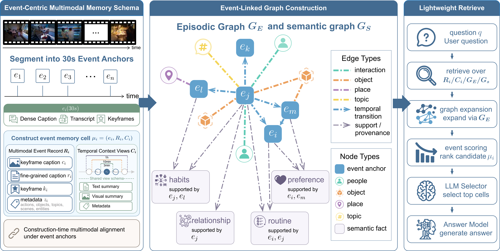

<h1 align="center"> EM²Mem: Event-Centric Multimodal Memory for Large Language Models </h1>

---

**EM²Mem** is an event-centric multimodal memory framework for long-video question answering. Instead of retrieving captions, frames, transcripts, summaries, or graph facts as isolated fragments, EM²Mem organizes heterogeneous evidence under shared event anchors. Each event-indexed memory cell binds visual observations, transcript context, structured metadata, temporal context, graph relations, semantic facts, and provenance into a query-ready evidence unit.

<div align=center></div>

## Key Contributions

### 1. Event-Centric Multimodal Memory Cells

EM²Mem treats events as the primary retrieval unit. A long video is divided into short event anchors, and each anchor stores a **multimodal memory cell** containing:

- **Local multimodal evidence**: keyframe captions, dialogue or transcript context, representative frames, and timestamps
- **Structured event fields**: actions, objects, scenes, topics, entities, and salient visual cues
- **Provenance**: evidence remains grounded to the original event anchor for attribution

This align-then-retrieve design moves cross-modal alignment into memory construction, so inference retrieves grounded event-level evidence instead of forcing the LLM to stitch together disconnected fragments.

### 2. Multi-Scale Temporal Context

EM²Mem builds temporal context views over multiple granularities, such as 30-second events, 3-minute windows, 10-minute windows, and 1-hour windows. These context views let the memory answer questions that depend on both local observations and longer-range activity continuity.

This is useful for questions about routines, task progress, relationships between events, and temporally distant supporting evidence.

### 3. Event-Linked Episodic and Semantic Graphs

Beyond individual memory cells, EM²Mem builds two lightweight graph indices:

- **Episodic graph**: connects event anchors through shared people, objects, scenes, topics, and temporal transitions
- **Semantic graph**: consolidates recurring patterns such as habits, preferences, routines, and stable relationships, while keeping links back to supporting events

At inference time, dense retrieval first finds relevant event cells, then graph expansion brings in related episodic evidence and supporting semantic facts.

### 4. Compact Evidence Readout for Long-Video QA

Given a question, EM²Mem retrieves and expands relevant event cells, then compiles a compact query-specific evidence view containing selected captions, transcripts, structured fields, temporal summaries, semantic facts, and visual evidence. The answer model conditions on this evidence view instead of the full video or a large pool of raw fragments.

This shifts part of the cost from query-time reasoning to offline memory construction, making EM²Mem especially suitable for long videos that are processed once and queried many times.

## Usage Example

The current LightMem integration focuses on the EgoLife pipeline. See [`experiments/egolife/`](./experiments/egolife/) for preprocessing, memory construction, embedding precomputation, and evaluation scripts.

### Quick Start

Set up the EgoLife experiment environment with `uv`:

```bash
cd experiments/egolife
bash scripts/1_setup.sh --skip-data
source .venv/bin/activate
```

Prepare your API credentials either as environment variables or through an explicit `.env` file passed with `--env-file`:

```bash
export OPENAI_API_KEY="your_api_key"
export OPENAI_MODEL="gpt-5-mini"
```

Run the EgoLife pipeline:

```bash
# 1. Translate dense captions and generate synchronized EgoLife records
bash scripts/2_preprocess.sh \
  --person A1_JAKE \
  --base-dir data/EgoLife

# 2. Build event-centric multimodal memory cells and episodic graphs
bash scripts/3_build_multimodal_memory_cell.sh \
  --person A1_JAKE \
  --base-dir data/EgoLife \
  --output-dir output

# 3. Build the semantic graph from episodic evidence
bash scripts/4_build_semantic_graph.sh \
  --person A1_JAKE \
  --output-dir output

# 4. Precompute dense RAG embeddings for parallel evaluation
bash scripts/5_precompute_rag_embeddings.sh \
  --person A1_JAKE \
  --output-dir output \
  --text-embedding-model Qwen/Qwen3-Embedding-4B

# 5. Evaluate EM²Mem on EgoLifeQA
bash scripts/6_eval.sh \
  --person A1_JAKE \
  --data-dir data/EgoLife \
  --output-dir output \
  --retriever-model gpt-5-mini \
  --respond-model gpt-5 \
  --text-embedding-model Qwen/Qwen3-Embedding-4B
```

All paths can be overridden from the command line. For local data or generated memory outputs outside the repository, pass explicit `--base-dir`, `--data-dir`, and `--output-dir` values.

### Programmatic Use

After memory construction, EM²Mem can be loaded directly through the `em2mem` package:

```python
from em2mem.embedding import EmbeddingModel
from em2mem.llm import LLMModel, PromptTemplateManager
from em2mem.memory import EM2Memory

embedding_model = EmbeddingModel(
    text_model_name="Qwen/Qwen3-Embedding-4B",
    device="cuda",
)
embedding_model.load_model("text")

em2mem = EM2Memory(
    embedding_model=embedding_model,
    retriever_llm_model=LLMModel("gpt-5-mini"),
    respond_llm_model=LLMModel("gpt-5", fps=1),
    prompt_template_manager=PromptTemplateManager(),
    episodic_cache_tag="A1_JAKE",
    semantic_cache_tag="A1_JAKE",
)

em2mem.set_retrieval_top_k(episodic=5, semantic=8, visual=3)
em2mem.load_episodic_captions(caption_files=episodic_caption_files)
em2mem.load_episodic_sidecar(
    triplet_files=episodic_triplet_files,
    graph_files=episodic_graph_files,
)
em2mem.load_semantic_triples(file_path="output/metadata/semantic_graph/A1_JAKE/semantic_graph_gpt-5-mini.json")

# EgoLife uses the event record directly for visual evidence. The record contains
# event-aligned keyframe paths, keyframe captions, visual objects, and scene fields.
em2mem.load_visual_clips(
    clips_path="output/metadata/multimodal_memory_cell/A1_JAKE/A1_JAKE_record.json",
)

result = em2mem.answer(
    query="What task was the person preparing to do?",
    choices={"A": "...", "B": "...", "C": "...", "D": "..."},
    until_time=1123045,
)

print(result.answer)
```

## Experimental Results

For EM²Mem experimental results and reproducible EgoLife commands, see [`experiments/egolife/readme.md`](./experiments/egolife/readme.md#results).
