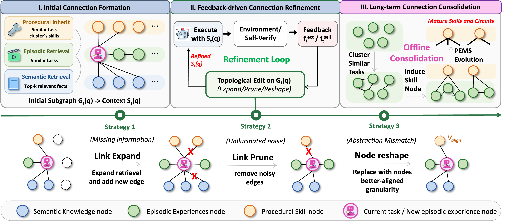

<h1 align="center"> FluxMem: Rethinking Memory as Continuously Evolving Connectivity </h1>

---

**FluxMem** is a connectivity-evolving memory framework for LLM agents that models memory as a heterogeneous graph and progressively refines its topology through three stages: initial connection formation, feedback-driven refinement, and long-term consolidation. Instead of treating semantic facts, episodic trajectories, and procedural skills as isolated stores, FluxMem links them through typed edges and continuously rewires the graph as the agent acts, fails, recovers, and consolidates experience.

<div align=center></div>

## Key Contributions

### 1. Heterogeneous Three-Layer Memory Graph

FluxMem represents memory as a heterogeneous graph with three node types and three edge types, so that factual knowledge, lived experience, and reusable skills coexist in a single connectivity structure:

- **Semantic nodes** (`SemanticNode`): factual knowledge chunks with embeddings
- **Episodic nodes** (`EpisodicNode`): task execution trajectories of observation-action pairs
- **Procedural nodes** (`ProceduralNode`): distilled, reusable skills and reasoning patterns
- **`GroundEdge`** (Semantic → Episodic): facts provide evidence for episodic steps
- **`DistillEdge`** (Episodic → Procedural): skills distilled from recurrent experiences
- **`StepLinkEdge`** (Any → Any): temporary step-level connections built during execution

This typed graph replaces the flat retrieval pool of conventional memory systems and lets retrieval, refinement, and consolidation operate on the same shared substrate.

### 2. Three-Stage Connectivity Pipeline

FluxMem evolves its memory through three coordinated stages instead of a one-shot read-write loop:

- **Stage I — Initial Connection Formation** (online, per step): retrieves relevant semantic, episodic, and procedural memories and builds an initial subgraph of `StepLinkEdge` connections for the current step.
- **Stage II — Feedback-Driven Connectivity Refinement** (online, per step): when execution fails, attributes the failure cause and repairs the graph by expanding missing connections, pruning interfering edges, or reshaping node granularity.
- **Stage III — Long-Term Connection Consolidation** (offline, periodic): clusters similar episodic trajectories, induces procedural skills via distillation, and iteratively refines them until PEMS convergence.

Together, these stages let memory grow, self-correct, and consolidate, instead of monotonically accumulating raw traces.

### 3. PEMS-Guided Evolutionary Maturity

FluxMem uses **PEMS** (a metric for memory generalizability and evolutionary maturity) as the convergence signal for Stage III. Procedural skills are repeatedly distilled and refined until PEMS stabilizes within a configurable threshold (`pems_threshold`, default `0.01`), giving consolidation a principled stopping criterion rather than a fixed iteration count.

This makes the long-term memory measurable: the framework decides when learned skills are mature enough to stop rewriting, instead of forever overwriting them.

### 4. Pluggable Backends for Real Deployments

FluxMem ships with OpenAI-based defaults but exposes abstract base classes (`BaseLLM`, `BaseEmbedder`, `BaseVectorStore`) so any component can be replaced — local LLMs, custom embedding models, or alternative vector stores — without touching the graph, the three-stage pipeline, or the PEMS metric.

This decouples the memory mechanism from any specific model or infrastructure, which makes FluxMem easier to embed inside larger agent systems such as LightMem.

## Usage Example

The current LightMem integration places the FluxMem package under [`src/fluxmem/`](./src/fluxmem/). The package can be imported directly once the optional dependencies are installed.

### Quick Start

Install the optional FluxMem extras from the LightMem project root:

```bash
# Inside the LightMem environment
pip install -e ".[fluxmem]"
```

Prepare your API credentials either as environment variables or through an explicit `.env` file:

```bash
export OPENAI_API_KEY="your_api_key"
```

### Programmatic Use

After installing the extras, FluxMem can be loaded directly through the `fluxmem` package:

```python
import asyncio
from fluxmem import FluxMemAgent, FluxMemConfig, OpenAILLM, OpenAIEmbedder


async def main():
    # 1. Initialize the agent
    config = FluxMemConfig(top_k_semantic=3, top_k_episodic=2)
    llm = OpenAILLM(model="gpt-4o-mini")
    embedder = OpenAIEmbedder()
    agent = FluxMemAgent(llm=llm, embedder=embedder, config=config)

    # 2. Add knowledge into the semantic layer
    await agent.add_knowledge("Your fact documents here...", source="docs")

    # 3. Execute a task with Stage I retrieval and Stage II refinement
    async def execute_fn(context: str):
        result = do_something(context)
        return (result, feedback, success)

    result = await agent.run_task(
        task_query="Your task description",
        execute_fn=execute_fn,
        observations=["Initial observation"],
    )

    # 4. Offline Stage III consolidation
    consolidation = await agent.consolidate()
    print(consolidation)


asyncio.run(main())
```

Custom backends can be plugged in by subclassing the interfaces in [`src/fluxmem/interfaces/`](./src/fluxmem/interfaces/):

```python
from fluxmem.interfaces.llm import BaseLLM
from fluxmem.interfaces.embedder import BaseEmbedder
from fluxmem.interfaces.vectorstore import BaseVectorStore


class MyLLM(BaseLLM):
    async def generate(self, prompt, system_prompt=None, temperature=0.7) -> str: ...
    async def verify(self, claim, evidence) -> float: ...
    async def extract_skills(self, trajectories) -> str: ...
    async def refine_skill(self, skill_text, feedback) -> str: ...
    async def attribute_failure(self, context, feedback) -> dict: ...
    async def reshape_content(self, node_content, target_granularity, context) -> str: ...


agent = FluxMemAgent(
    llm=MyLLM(),
    embedder=MyEmbedder(),
    semantic_vectorstore=MyVectorStore(dim=768),
    episodic_vectorstore=MyVectorStore(dim=768),
)
```

### Configuration

FluxMem exposes `FluxMemConfig` for controlling retrieval, refinement, and consolidation behaviour:

| Parameter | Default | Description |
|-----------|---------|-------------|
| `top_k_semantic` | 5 | Top-k semantic retrieval results |
| `top_k_episodic` | 3 | Top-k episodic retrieval results |
| `max_refinement_rounds` | 5 | Max Stage II refinement iterations |
| `num_clusters` | None | Number of clusters for Stage III (auto if None) |
| `max_consolidation_rounds` | 5 | Max Stage III consolidation iterations |
| `pems_threshold` | 0.01 | PEMS convergence threshold (ε) |
| `dense_weight` | 1.0 | Dense retrieval weight |
| `bm25_weight` | 0.5 | BM25 retrieval weight |
| `llm_weight` | 0.3 | LLM-based retrieval weight |
| `embedding_dimension` | 1536 | Embedding vector dimension |
| `llm_model` | gpt-4o-mini | Default LLM model name |
| `embedding_model` | text-embedding-3-small | Default embedding model name |
| `temperature` | 0.7 | Default generation temperature |

## Citation

```bibtex
@inproceedings{fang2026fluxmem,
  title={Rethinking Memory as Continuously Evolving Connectivity},
  author={Fang, Jizhan and Xu, Buqiang and Wang, Zhixian and Cao, Haoliang and Deng, Xinle and Dong, Baohua and Zhu, Hangcheng and Huang, Ruohui and Yu, Gang and Wei, Ying and Zheng, Guozhou and Xiong, Feiyu and Wang, Haofen and Chen, Huajun and Zhang, Ningyu},
  booktitle={Proceedings of the 2026 Conference on Empirical Methods in Natural Language Processing (EMNLP)},
  year={2026}
}
```
